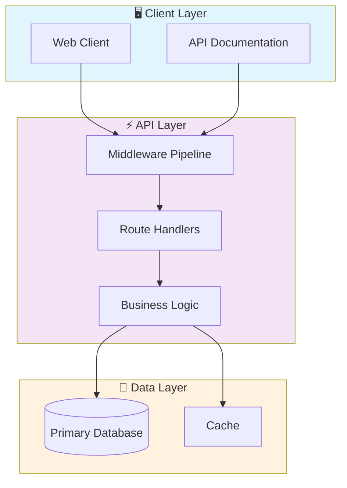
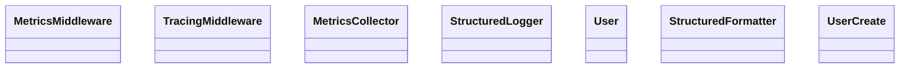

# 🚀 Microservices Observability Platform

> Professional Python project implementing Microservices Observability Platform

[](https://img.shields.io/badge/)
[](https://img.shields.io/badge/)
[](https://img.shields.io/badge/)
[](https://img.shields.io/badge/)
[](https://img.shields.io/badge/)
[](https://img.shields.io/badge/)
[](LICENSE)

[English](#english) | [Português](#português)

---

## English

### 🎯 Overview

**Microservices Observability Platform** is a production-grade Python application that showcases modern software engineering practices including clean architecture, comprehensive testing, containerized deployment, and CI/CD readiness.

The codebase comprises **546 lines** of source code organized across **5 modules**, following industry best practices for maintainability, scalability, and code quality.

### ✨ Key Features

- **⚡ Async API**: High-performance async REST API with FastAPI
- **📖 Auto-Documentation**: Interactive Swagger UI and ReDoc
- **✅ Validation**: Pydantic-powered request/response validation
- **🐳 Containerized**: Docker support for consistent deployment
- **📡 REST API**: 7 endpoints with full CRUD operations
- **🏗️ Object-Oriented**: 7 core classes with clean architecture

### 🏗️ Architecture





### 📡 API Endpoints

| Method | Endpoint | Description |
|--------|----------|-------------|
| `GET` | `/metrics` | Retrieve Metrics |
| `GET` | `/` | Retrieve resource (list/create) |
| `GET` | `/users` | Retrieve Users |
| `GET` | `/users/{user_id}` | Retrieve Users by ID |
| `POST` | `/users` | Create Users |
| `DELETE` | `/users/{user_id}` | Delete Users by ID |

### 🚀 Quick Start

#### Prerequisites

- Python 3.12+
- pip (Python package manager)

#### Installation

```bash
# Clone the repository
git clone https://github.com/galafis/microservices-observability-platform.git
cd microservices-observability-platform

# Create and activate virtual environment
python -m venv venv
source venv/bin/activate  # On Windows: venv\Scripts\activate

# Install dependencies
pip install -r requirements.txt
```

#### Running

```bash
# Run the application
python services/user-service/main.py
```

### 🐳 Docker

```bash
# Start all services
docker-compose up -d

# View logs
docker-compose logs -f

# Stop all services
docker-compose down

# Rebuild after changes
docker-compose up -d --build
```

### 📁 Project Structure

```
microservices-observability-platform/
├── docs/          # Documentation
│   ├── FAQ.md
│   ├── USE_CASES.md
│   └── observability.md
├── infrastructure/
│   └── prometheus/
│       └── prometheus.yml
├── sdk/
│   └── observability_sdk/
│       ├── __init__.py
│       ├── logging.py
│       ├── metrics.py
│       └── tracing.py
├── services/      # Business logic
│   └── user-service/
│       └── main.py
├── tests/         # Test suite
│   ├── __init__.py
│   └── test_main.py
├── CHANGELOG.md
├── Dockerfile
├── LICENSE
├── README.md
├── docker-compose.yml
└── requirements.txt
```

### 🛠️ Tech Stack

| Technology | Description | Role |
|------------|-------------|------|
| **Python** | Core Language | Primary |
| **Docker** | Containerization platform | Framework |
| **FastAPI** | High-performance async web framework | Framework |
| **Prometheus** | Monitoring & alerting | Framework |
| **Redis** | In-memory data store | Framework |
| **SQLAlchemy** | SQL toolkit and ORM | Framework |

### 🚀 Deployment

#### Cloud Deployment Options

The application is containerized and ready for deployment on:

| Platform | Service | Notes |
|----------|---------|-------|
| **AWS** | ECS, EKS, EC2 | Full container support |
| **Google Cloud** | Cloud Run, GKE | Serverless option available |
| **Azure** | Container Instances, AKS | Enterprise integration |
| **DigitalOcean** | App Platform, Droplets | Cost-effective option |

```bash
# Production build
docker build -t microservices-observability-platform:latest .

# Tag for registry
docker tag microservices-observability-platform:latest registry.example.com/microservices-observability-platform:latest

# Push to registry
docker push registry.example.com/microservices-observability-platform:latest
```

### 🤝 Contributing

Contributions are welcome! Please feel free to submit a Pull Request. For major changes, please open an issue first to discuss what you would like to change.

1. Fork the project
2. Create your feature branch (`git checkout -b feature/AmazingFeature`)
3. Commit your changes (`git commit -m 'Add some AmazingFeature'`)
4. Push to the branch (`git push origin feature/AmazingFeature`)
5. Open a Pull Request

### 📄 License

This project is licensed under the MIT License - see the [LICENSE](LICENSE) file for details.

### 👤 Author

**Gabriel Demetrios Lafis**
- GitHub: [@galafis](https://github.com/galafis)
- LinkedIn: [Gabriel Demetrios Lafis](https://linkedin.com/in/gabriel-demetrios-lafis)

---

## Português

### 🎯 Visão Geral

**Microservices Observability Platform** é uma aplicação Python de nível profissional que demonstra práticas modernas de engenharia de software, incluindo arquitetura limpa, testes abrangentes, implantação containerizada e prontidão para CI/CD.

A base de código compreende **546 linhas** de código-fonte organizadas em **5 módulos**, seguindo as melhores práticas do setor para manutenibilidade, escalabilidade e qualidade de código.

### ✨ Funcionalidades Principais

- **⚡ Async API**: High-performance async REST API with FastAPI
- **📖 Auto-Documentation**: Interactive Swagger UI and ReDoc
- **✅ Validation**: Pydantic-powered request/response validation
- **🐳 Containerized**: Docker support for consistent deployment
- **📡 REST API**: 7 endpoints with full CRUD operations
- **🏗️ Object-Oriented**: 7 core classes with clean architecture

### 🏗️ Arquitetura


### 📡 API Endpoints

| Method | Endpoint | Description |
|--------|----------|-------------|
| `GET` | `/metrics` | Retrieve Metrics |
| `GET` | `/` | Retrieve resource (list/create) |
| `GET` | `/users` | Retrieve Users |
| `GET` | `/users/{user_id}` | Retrieve Users by ID |
| `POST` | `/users` | Create Users |
| `DELETE` | `/users/{user_id}` | Delete Users by ID |

### 🚀 Início Rápido

#### Prerequisites

- Python 3.12+
- pip (Python package manager)

#### Installation

```bash
# Clone the repository
git clone https://github.com/galafis/microservices-observability-platform.git
cd microservices-observability-platform

# Create and activate virtual environment
python -m venv venv
source venv/bin/activate  # On Windows: venv\Scripts\activate

# Install dependencies
pip install -r requirements.txt
```

#### Running

```bash
# Run the application
python services/user-service/main.py
```

### 🐳 Docker

```bash
# Start all services
docker-compose up -d

# View logs
docker-compose logs -f

# Stop all services
docker-compose down

# Rebuild after changes
docker-compose up -d --build
```

### 📁 Estrutura do Projeto

```
microservices-observability-platform/
├── docs/          # Documentation
│   ├── FAQ.md
│   ├── USE_CASES.md
│   └── observability.md
├── infrastructure/
│   └── prometheus/
│       └── prometheus.yml
├── sdk/
│   └── observability_sdk/
│       ├── __init__.py
│       ├── logging.py
│       ├── metrics.py
│       └── tracing.py
├── services/      # Business logic
│   └── user-service/
│       └── main.py
├── tests/         # Test suite
│   ├── __init__.py
│   └── test_main.py
├── CHANGELOG.md
├── Dockerfile
├── LICENSE
├── README.md
├── docker-compose.yml
└── requirements.txt
```

### 🛠️ Stack Tecnológica

| Tecnologia | Descrição | Papel |
|------------|-----------|-------|
| **Python** | Core Language | Primary |
| **Docker** | Containerization platform | Framework |
| **FastAPI** | High-performance async web framework | Framework |
| **Prometheus** | Monitoring & alerting | Framework |
| **Redis** | In-memory data store | Framework |
| **SQLAlchemy** | SQL toolkit and ORM | Framework |

### 🚀 Deployment

#### Cloud Deployment Options

The application is containerized and ready for deployment on:

| Platform | Service | Notes |
|----------|---------|-------|
| **AWS** | ECS, EKS, EC2 | Full container support |
| **Google Cloud** | Cloud Run, GKE | Serverless option available |
| **Azure** | Container Instances, AKS | Enterprise integration |
| **DigitalOcean** | App Platform, Droplets | Cost-effective option |

```bash
# Production build
docker build -t microservices-observability-platform:latest .

# Tag for registry
docker tag microservices-observability-platform:latest registry.example.com/microservices-observability-platform:latest

# Push to registry
docker push registry.example.com/microservices-observability-platform:latest
```

### 🤝 Contribuindo

Contribuições são bem-vindas! Sinta-se à vontade para enviar um Pull Request.

### 📄 Licença

Este projeto está licenciado sob a Licença MIT - veja o arquivo [LICENSE](LICENSE) para detalhes.

### 👤 Autor

**Gabriel Demetrios Lafis**
- GitHub: [@galafis](https://github.com/galafis)
- LinkedIn: [Gabriel Demetrios Lafis](https://linkedin.com/in/gabriel-demetrios-lafis)
