# 🔭 Observability Platform Documentation

## Three Pillars of Observability

```mermaid
graph TB
    subgraph "Observability Platform"
        Logs[📝 Logs]
        Metrics[📊 Metrics]
        Traces[🔍 Traces]
    end
    
    subgraph "Collection"
        SDK[Observability SDK]
    end
    
    subgraph "Storage & Analysis"
        Loki[(Loki)]
        Prom[(Prometheus)]
        Jaeger[(Jaeger)]
    end
    
    subgraph "Visualization"
        Grafana[Grafana Dashboards]
    end
    
    SDK -->|Structured Logs| Logs
    SDK -->|Metrics| Metrics
    SDK -->|Spans| Traces
    
    Logs --> Loki
    Metrics --> Prom
    Traces --> Jaeger
    
    Loki --> Grafana
    Prom --> Grafana
    Jaeger --> Grafana
```



## Distributed Tracing Flow


## Metrics Collection Architecture

```mermaid
graph LR
    subgraph "Microservices"
        S1[User Service]
        S2[Order Service]
        S3[Payment Service]
    end
    
    subgraph "Metrics Exporters"
        E1[/metrics endpoint]
        E2[/metrics endpoint]
        E3[/metrics endpoint]
    end
    
    subgraph "Prometheus"
        Prom[Prometheus Server]
        Alert[Alertmanager]
    end
    
    subgraph "Visualization"
        Graf[Grafana]
    end
    
    S1 --> E1
    S2 --> E2
    S3 --> E3
    
    E1 -->|Scrape| Prom
    E2 -->|Scrape| Prom
    E3 -->|Scrape| Prom
    
    Prom -->|Alerts| Alert
    Prom -->|Query| Graf
```

## Logging Pipeline


## SDK Components

### 1. Tracing Module

```python
from observability_sdk import setup_tracing

# Initialize tracing
tracer = setup_tracing(
    service_name="user-service",
    jaeger_host="localhost",
    jaeger_port=6831
)

# Create spans
with tracer.start_as_current_span("process_request") as span:
    span.set_attribute("user_id", user_id)
    span.set_attribute("request_type", "GET")
    # Your code here
```

### 2. Metrics Module

```python
from observability_sdk import MetricsCollector

metrics = MetricsCollector(
    service_name="user-service",
    prometheus_port=8000
)

# Counter
metrics.increment_counter("requests_total", {"endpoint": "/users"})

# Histogram
metrics.record_histogram("request_duration_seconds", duration)

# Gauge
metrics.set_gauge("active_connections", count)
```

### 3. Logging Module

```python
from observability_sdk import setup_logging

logger = setup_logging(
    service_name="user-service",
    log_level="INFO"
)

# Structured logging
logger.info("User created", extra={
    "user_id": user_id,
    "email": email,
    "trace_id": trace_id
})
```

## Metrics Types

### Application Metrics

| Metric | Type | Description |
|--------|------|-------------|
| `http_requests_total` | Counter | Total HTTP requests |
| `http_request_duration_seconds` | Histogram | Request latency |
| `active_connections` | Gauge | Current connections |
| `error_rate` | Counter | Error count |

### Business Metrics

| Metric | Type | Description |
|--------|------|-------------|
| `orders_created_total` | Counter | Total orders |
| `revenue_total` | Counter | Total revenue |
| `active_users` | Gauge | Current active users |
| `conversion_rate` | Gauge | Conversion percentage |

### Infrastructure Metrics

| Metric | Type | Description |
|--------|------|-------------|
| `cpu_usage_percent` | Gauge | CPU utilization |
| `memory_usage_bytes` | Gauge | Memory consumption |
| `disk_io_bytes` | Counter | Disk I/O |
| `network_bytes_sent` | Counter | Network traffic |

## Dashboard Examples

### Service Health Dashboard

```
┌─────────────────────────────────────────────────┐
│ Service Health Overview                          │
├─────────────────────────────────────────────────┤
│                                                  │
│ Request Rate: 1,234 req/s  ↑ 5%                │
│ Error Rate:   0.5%         ↓ 2%                │
│ Latency p99:  45ms         ↓ 10ms              │
│ Active Users: 5,678        ↑ 12%               │
│                                                  │
├─────────────────────────────────────────────────┤
│ [Request Rate Graph]                             │
│ [Error Rate Graph]                               │
│ [Latency Distribution]                           │
└─────────────────────────────────────────────────┘
```

### Distributed Trace View

```
Request: POST /api/orders
Duration: 245ms
Status: 200 OK

├─ gateway_request (245ms)
│  ├─ user_auth (45ms)
│  │  └─ db_query_user (30ms)
│  ├─ create_order (150ms)
│  │  ├─ validate_order (10ms)
│  │  ├─ db_insert_order (120ms)
│  │  └─ publish_event (20ms)
│  └─ send_response (5ms)
```

## Alert Rules

### Critical Alerts

```yaml
- alert: HighErrorRate
  expr: rate(http_requests_total{status=~"5.."}[5m]) > 0.05
  for: 5m
  annotations:
    summary: "High error rate detected"
    
- alert: HighLatency
  expr: histogram_quantile(0.99, http_request_duration_seconds) > 1.0
  for: 10m
  annotations:
    summary: "High latency detected"
```

## Best Practices

### 1. Structured Logging
```python
# ✅ Good
logger.info("User login", extra={"user_id": 123, "ip": "1.2.3.4"})

# ❌ Bad
logger.info(f"User {user_id} logged in from {ip}")
```

### 2. Meaningful Span Names
```python
# ✅ Good
with tracer.start_span("database.query.users"):
    ...

# ❌ Bad
with tracer.start_span("query"):
    ...
```

### 3. Metric Naming Convention
```
# Pattern: <namespace>_<name>_<unit>
http_requests_total
http_request_duration_seconds
database_connections_active
```

## Integration Example

```python
from fastapi import FastAPI
from observability_sdk import (
    setup_tracing,
    setup_logging,
    MetricsCollector
)

app = FastAPI()

# Setup observability
tracer = setup_tracing("my-service")
logger = setup_logging("my-service")
metrics = MetricsCollector("my-service")

@app.get("/users/{user_id}")
async def get_user(user_id: int):
    with tracer.start_as_current_span("get_user") as span:
        span.set_attribute("user_id", user_id)
        
        logger.info("Fetching user", extra={"user_id": user_id})
        metrics.increment_counter("user_requests_total")
        
        start_time = time.time()
        user = await fetch_user(user_id)
        duration = time.time() - start_time
        
        metrics.record_histogram("user_fetch_duration", duration)
        
        return user
```

## Stack Components

| Component | Purpose | Port |
|-----------|---------|------|
| **Jaeger** | Distributed tracing | 16686 (UI), 6831 (agent) |
| **Prometheus** | Metrics collection | 9090 (UI), 9091 (pushgateway) |
| **Grafana** | Visualization | 3000 |
| **Loki** | Log aggregation | 3100 |

## Getting Started

```bash
# Start full observability stack
docker-compose up -d

# Access dashboards
# Jaeger:     http://localhost:16686
# Prometheus: http://localhost:9090
# Grafana:    http://localhost:3000 (admin/admin)
```
